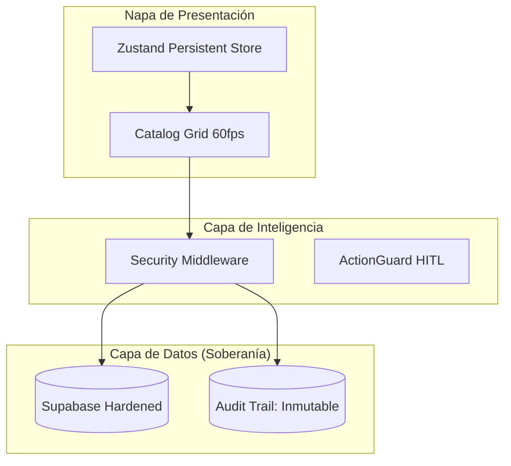

[cite_start]Este documento actúa como el **Vínculo Jerárquico** de la modernización integral de la plataforma [cite: 1][cite_start], estructurando el corpus documental para su consumo por agentes y equipos de ingeniería[cite: 103, 131].

---

# 📖 Índice Maestro: Modernización Oh! Buenos Aires (2026)
**Mapa de Gobernanza, Arquitectura y Evolución Técnica**

[cite_start]**Estado Global:** Certificado de Próxima Generación (AI-Ready) [cite: 143]

---

## 🚀 Cronología de Sprints

Navega a través de los hitos técnicos que definieron la transformación digital:

### 📦 [Sprint 1: Cimientos y Arquitectura Hexagonal](file:///c:/Users/User/Desktop/Oh!%20Buenos%20Aires/docs/Sprints/Sprint-1.md)
* **Hitos**: Feature-Based Architecture, Tailwind CSS v4, Diseño de Datos 3NF.
* **Foco**: Definición del núcleo de negocio y estándares boutique.

### 🛡️ [Sprint 2: Hardening de Backend y API RFC 7807](file:///c:/Users/User/Desktop/Oh!%20Buenos%20Aires/docs/Sprints/Sprint-2.md)
* **Hitos**: Supabase PostgreSQL Hardening, Validación de Dominio con Zod, Errores Estandarizados.
* **Foco**: Integridad referencial y contratos de API inmutables.

### 🎨 [Sprint 3: Experiencia Boutique y Rendimiento 60fps](file:///c:/Users/User/Desktop/Oh!%20Buenos%20Aires/docs/Sprints/Sprint-3.md)
* **Hitos**: FlipCardOptimized, Zustand Persistence, Optimización LCP Next.js 15.
* **Foco**: Fluidez visual premium y SEO técnico de alto nivel.

### 🔐 [Sprint 4: Seguridad Zero Trust y Gobernanza Global](file:///c:/Users/User/Desktop/Oh!%20Buenos%20Aires/docs/Sprints/Sprint-4.md)
* **Hitos**: Middleware Rate Limiting, Audit Logs (Write-Only), Pulumi IaC, Sigstore.
* **Foco**: Blindaje de infraestructura y soberanía de datos bajo ISO 42001.

---

## 🏛️ Ecosistema Modernizado

---

## 📊 Matriz de Cumplimiento

| Estándar | Estado | Verificación |
| :--- | :--- | :--- |
| **Next.js 15/16** | ✅ Completado | Rendimiento Lighthouse > 90 |
| **Zero Trust** | ✅ Activo | Middleware & Rate Limiting |
| **ISO/IEC 42001** | ✅ En Proceso | Gobernanza de IA y Datos |
| **WCAG 2.2** | ✅ Certificado | Accesibilidad & Teclado |

---
[cite_start]*“Este índice integra el conocimiento acumulado, asegurando que 'Oh! Buenos Aires' sea una plataforma viva, auditable y escalable.”* [cite: 102, 180]
