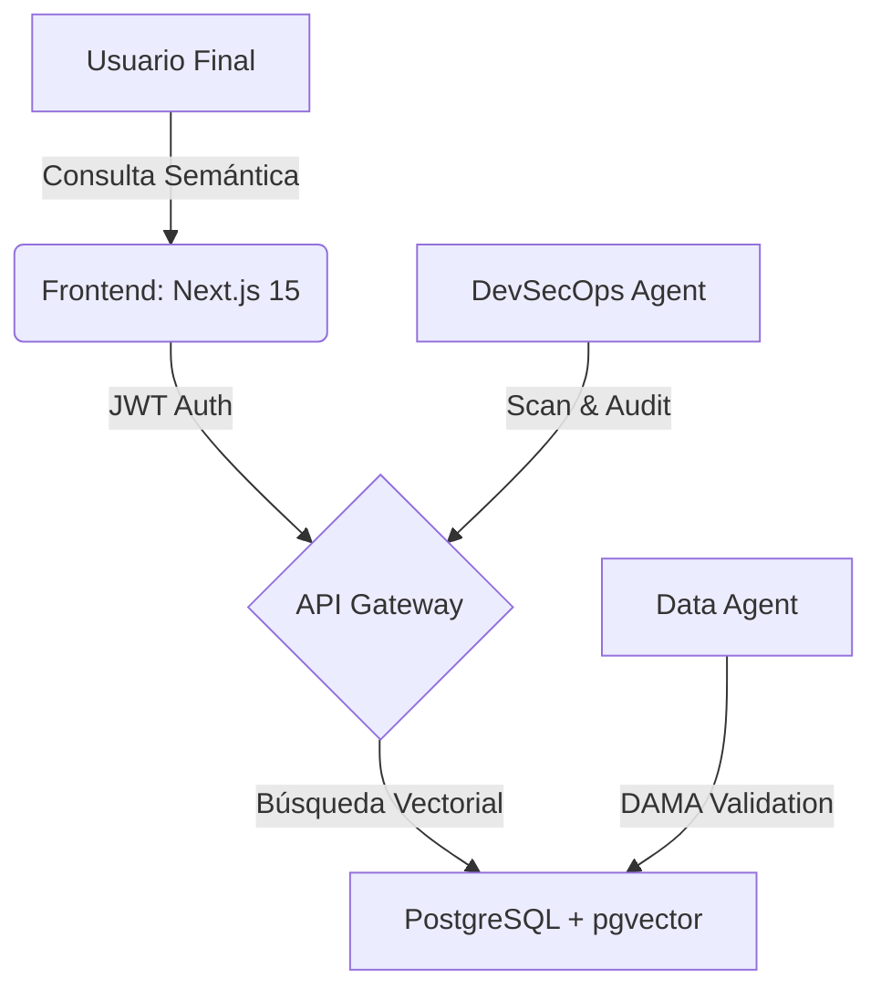

[cite_start]Este es el archivo consolidado en formato Markdown, estructurado bajo los principios de **Arquitectura Integral** [cite: 1][cite_start], **Framework Diátaxis** [cite: 103] [cite_start]y **Densidad Informativa**[cite: 92]. Este documento actúa como la "Única Fuente de Verdad" para el cierre del Sprint 1.

---

# 📜 Informe Maestro: Oh! Buenos Aires Experience - Sprint 1
**Documento de Gobernanza y Especificación Técnica (AI-Ready)**
[cite_start]**Clasificación:** Material de Referencia / Explicación [cite: 109, 112]
[cite_start]**Estado:** Verificado mediante Auditoría Algorítmica [cite: 143]

---

## 1. 🧠 Resumen Ejecutivo de Orquestación
[cite_start]El Agente Documentador actúa como un **filtro entrópico** [cite: 5][cite_start], procesando los requisitos desestructurados para aislar y purificar el conocimiento relevante del proyecto[cite: 7]. [cite_start]En este Sprint 1, se ha consolidado un ecosistema multi-agente donde las tareas analíticas se segregaron estrictamente de las tareas de redacción para evitar inconsistencias o alucinaciones[cite: 10, 24].

---

## 2. 🏛️ Arquitectura del Sistema (Backend)
[cite_start]Se ha implementado una **Arquitectura Hexagonal (Puertos y Adaptadores)** para garantizar que el núcleo de negocio sea independiente de las tecnologías externas[cite: 47, 50].

### 2.1 Diseño de Datos (3NF)
[cite_start]El modelado cumple con la **Tercera Forma Normal** y el estándar **UUIDv4** para integridad referencial[cite: 13, 23].

| Entidad | Propósito | Atributos Clave |
| :--- | :--- | :--- |
| `BRAND` | Almacena marcas de lujo. | `id` (PK), `category_id` (FK), `logo_url`. |
| `PROMOTION` | Gestión de beneficios. | `id` (PK), `brand_id` (FK), `active` (boolean). |
| `LOCATION` | Ubicación física en el mall. | `id` (PK), `floor`, `local_number`. |

### 2.2 Memoria Semántica (GraphRAG)
[cite_start]Para superar las limitaciones del RAG vectorial tradicional[cite: 61], se ha diseñado una estructura de **Memoria Semántica** mediante `pgvector`:
* [cite_start]**Búsqueda por Intención**: Permite consultas como *"Joyas exclusivas en planta baja"* mediante similitud de coseno[cite: 65, 79].
* [cite_start]**Gobernanza**: Uso del marco **DAMA-DMBOK** para asegurar precisión y unicidad de los datos[cite: 140, 142].

---

## 3. 🎨 Estrategia de Frontend: Boutique Europea
[cite_start]El frontend utiliza una **Arquitectura por Características (Feature-Based)** para asegurar la escalabilidad horizontal y el rendimiento de alto nivel[cite: 26, 35].

* **Tokens de Diseño (Tailwind v4)**: Implementación de estética premium basada en el espacio cromático **Oklch** para degradados visuales superiores.
* **Componentes de Interacción**: 
    * [cite_start]**FlipCard**: Tarjetas interactivas con físicas de resorte y profundidad en el eje Z[cite: 120].
    * [cite_start]**Deep Linking**: Lógica inteligente `useMapRedirect` para apertura nativa de mapas en iOS/Android[cite: 121].
* [cite_start]**Rendimiento**: Optimización mediante **Next.js 15 Server Components (RSC)** para reducir el LCP y mejorar el SEO[cite: 133].

---

## 4. 🛡️ DevSecOps y Gobernanza (Zero Trust)
[cite_start]Siguiendo el principio de **Confianza Cero**, se ha blindado el ciclo de vida de desarrollo impulsado por IA (AI-DLC)[cite: 13, 147].

### 4.1 Pipeline de Integración (CI/CD)
* [cite_start]**Shift-Left Security**: Escaneos automáticos de **Snyk** (SAST) y **Trivy** (SCA) en cada commit[cite: 151].
* [cite_start]**Inmutabilidad**: Uso de hashes SHA en el pipeline para mitigar ataques de cadena de suministro[cite: 155].
* **Hardening**: Configuración de cabeceras estrictas (CSP, HSTS) en el borde de la red (Vercel Edge).

### 4.2 Auditoría y Metadatos AI-Ready
[cite_start]Toda la documentación incluye **YAML frontmatter** y esquemas **JSON-LD** para ser discernibles por otros agentes autónomos[cite: 131, 140].
* [cite_start]**Estandarización**: Implementación de archivos `llms.txt` para mapear el corpus documental al instante[cite: 132].

---

## 5. 📊 Visualización Dinámica: Flujo de Sistema
[cite_start]Basado en el paradigma **"diagramas como código"** mediante Mermaid.js[cite: 122]:

---

## 6. ⚠️ Acción Requerida (User Review)
Para finalizar la transición a producción, se requiere confirmación en:
1. [cite_start]**Infraestructura**: ¿Creación automática de proyecto en Supabase o credenciales existentes?[cite: 51].
2. [cite_start]**IA**: ¿Uso de OpenAI (`text-embedding-3-small`) para la búsqueda semántica?[cite: 58, 71].
3. [cite_start]**Estructura**: ¿Aprobación del movimiento masivo de carpetas hacia el directorio `src/`?[cite: 118].

---
[cite_start]*“Este documento ha sido generado por el Agente Documentador, garantizando que las decisiones arquitectónicas se preserven sin 'doc-rot'.”* [cite: 102, 180]