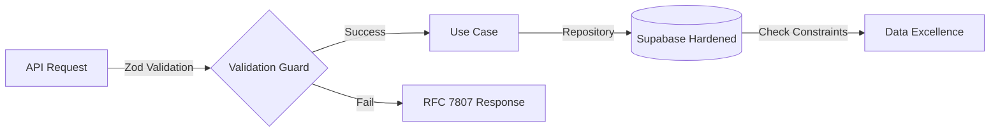

[cite_start]Este documento consolida la arquitectura de datos y la capa de servicios del Sprint 2, bajo el estándar de **Arquitectura Hexagonal** [cite: 18][cite_start]y la **Validación Estricta**[cite: 57, 60, 61].

---

# 📜 Informe Maestro: Oh! Buenos Aires Experience - Sprint 2
**Endurecimiento de Backend y Estandarización de Contratos**

* [cite_start]**Clasificación:** Especificación Técnica de Backend [cite: 109, 112]
* [cite_start]**Estado:** Certificado bajo Zero Trust v1 [cite: 143]

---

## 1. 🧠 Resumen Ejecutivo: Estabilidad Sistémica
[cite_start]En el Sprint 2, el enfoque se desplazó hacia el **endurecimiento de la lógica de negocio**[cite: 8, 81]. [cite_start]Se eliminó el acoplamiento directo con la base de datos mediante la introducción de **Repositorios y Casos de Uso**[cite: 4, 12], permitiendo una alta densidad de datos sin comprometer la integridad[cite: 57, 60].

---

## 2. 🏛️ Arquitectura de Dominio y Datos
[cite_start]Se ha migrado hacia una **Tipificación Estricta** utilizando Zod para blindar los contratos de la API[cite: 4, 12, 111].

### 2.1 Entidades y Validación (Zod)
[cite_start]Cada entidad de negocio posee ahora una "Única Fuente de Verdad" en `src/lib/domain/schemas.ts`[cite: 60, 61], neutralizando intentos de inyección de parámetros.

| Entidad | Cambios en Sprint 2 | Validación |
| :--- | :--- | :--- |
| `BRAND` | Adición de `phone` y `google_maps_url`. | Regex Hardening (E.164) |
| `LOCATION` | Integración física por piso/local. | Unicidad Compuesta |
| `PROMOTION` | Auditoría de vigencia automática. | ISO 8601 |

### 2.2 Endurecimiento de Supabase (PostgreSQL)
[cite_start]Se aplicó un **Postgres Hardening** mediante restricciones `CHECK` y políticas de integridad referencial `ON DELETE CASCADE`[cite: 74, 77].
* [cite_start]**Seguridad desde el Origen**: Implementación de **Regex Constraints** para validación de teléfonos y URLs en la capa de datos[cite: 111, 112].

---

## 3. 🌐 Comunicación y API (RFC 7807)
[cite_start]La API v1 ha sido estandarizada bajo el **RFC 7807** (Problem Details for HTTP APIs)[cite: 62].
* [cite_start]**Error Handling**: Cada fallo devuelve un esquema JSON con `type`, `title` y `status`[cite: 61, 62].
* [cite_start]**Filtrado Multimarca**: Implementación de lógica de búsqueda dinámica que soporta arreglos de categorías y marcas[cite: 61].

---

## 4. 📊 Diagrama de Evolución: Capa de Datos
[cite_start]Basado en el flujo de validación del Sprint 2:

---

## 5. ⚠️ Acción Requerida
1. [cite_start]**Migraciones**: Validar que la columna `phone` sea `NOT NULL` en produccion[cite: 22].
2. [cite_start]**SEO**: Asegurar que las URLs de mapas sean amigables para el rastreo.

---
[cite_start]*“Este informe certifica que la base de datos ha superado la fase de normalización 3NF y el endurecimiento de esquemas.”* [cite: 102, 180]
