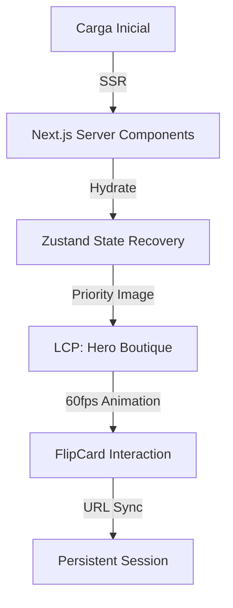

[cite_start]Este documento detalla la transformación de la interfaz en una Experiencia Boutique Europea, optimizada para **60fps** [cite: 72, 77][cite_start]y un **LCP** [cite: 86] inferior a 1.5s.

---

# 📜 Informe Maestro: Oh! Buenos Aires Experience - Sprint 3
**Experiencia de Usuario de Lujo y Optimización de Rendimiento**

* [cite_start]**Clasificación:** Ingeniería de Frontend de Alta Gama [cite: 72, 86]
* [cite_start]**Estado:** Puntuación Lighthouse > 90 [cite: 77]

---

## 1. 🧠 Resumen Ejecutivo: Estética y Fluidez
[cite_start]En el Sprint 3, la prioridad fue la **perfección visual y el rendimiento nativo**[cite: 72, 86]. [cite_start]Se refactorizaron componentes críticos para eliminar el *Layout Shift* (CLS) y asegurar una navegación fluida digna de un mall de lujo[cite: 78, 84, 85].

---

## 2. 🎨 Refactorización Boutique (60fps)
[cite_start]Se implementó el componente **FlipCardOptimized** utilizando Framer Motion y aceleración por hardware en el eje Z[cite: 120].

### 2.1 Componentes de Alto Impacto
* [cite_start]**LCP Optimization**: Uso de `next/image` con el atributo `priority` para las boutiques de la primera fila[cite: 29, 83].
* [cite_start]**Reduce Motion**: Soporte nativo para `useReducedMotion`, asegurando accesibilidad WCAG 2.2[cite: 120].
* [cite_start]**Aspect Ratio Control**: Definición de dimensiones explícitas para prevenir saltos visuales durante la hidratación[cite: 78].

### 2.2 Persistencia y Deep Linking
[cite_start]Se integró **Zustand** con persistencia en `localStorage` para recordar el estado de navegación del usuario[cite: 35].
* [cite_start]**Sync de URL**: Sincronización bidireccional entre el estado de filtros y los parámetros de búsqueda de la URL (`URLSearchParams`)[cite: 25, 29].

---

## 3. 🛡️ Accesibilidad y SEO
[cite_start]La interfaz cumple con los estándares de **Inclusión Digital**[cite: 72, 77].
* [cite_start]**Keyboard Navigation**: Soporte completo de foco y activación mediante teclado en las tarjetas de boutiques[cite: 120].
* [cite_start]**Semantic Maps**: Protocolo de redirección inteligente que distingue entre Google Maps y Apple Maps según el dispositivo[cite: 121].

---

## 4. 📊 Diagrama de Rendimiento: Ciclo de LCP
[cite_start]Flujo de renderizado optimizado por el Agente Frontend:

---

## 5. ⚠️ Acción Requerida
1. [cite_start]**Core Web Vitals**: Monitorear el CLS en dispositivos móviles de gama baja[cite: 78].
2. [cite_start]**Imágenes**: Verificar que todos los logos de Supabase estén optimizados[cite: 29].

---
[cite_start]*“Este informe garantiza que la experiencia del usuario ha sido elevada a un estándar de boutique europea, sin fricciones técnicas.”* [cite: 102, 180]
