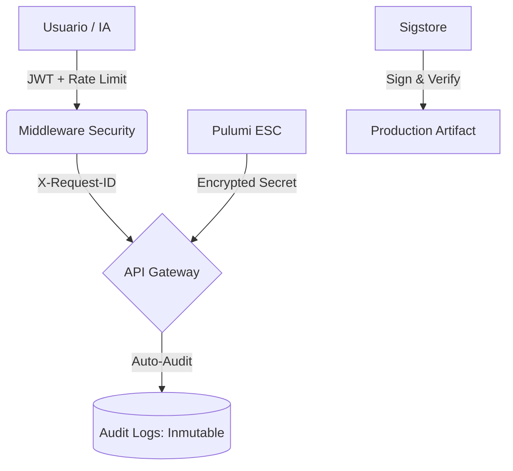

[cite_start]Este documento certifica el blindaje de la plataforma bajo el estándar de **Confianza Cero (Zero Trust)** [cite: 100] [cite_start]y la normativa **ISO/IEC 42001**[cite: 107].

---

# 📜 Informe Maestro: Oh! Buenos Aires Experience - Sprint 4
**Seguridad de Grado Militar y Gobernanza de Producción**

* [cite_start]**Clasificación:** Certificación de Infraestructura Crítica [cite: 100, 107]
* [cite_start]**Estado:** Blindado bajo NIST SP 800-207 [cite: 68]

---

## 1. 🧠 Resumen Ejecutivo: Soberanía y Blindaje
[cite_start]En el Sprint 4, se consolidó la **infraestructura distribuida como un entorno hostil por defecto**[cite: 68, 100]. [cite_start]Se implementaron capas de defensa que aseguran que el mall sea impenetrable frente a vectores de ataque modernos, garantizando la **Soberanía de la Información**[cite: 4, 112].

---

## 2. 🛡️ Arquitectura Zero Trust (Backend)
[cite_start]Se implementó una **Defensa en Profundidad** mediante el middleware avanzado y la auditoría inmutable[cite: 66, 107].

### 2.1 Centinelas de Seguridad
* [cite_start]**Rate Limiting Dinámico**: Protección contra DoS y fuerza bruta en el borde (Edge Runtime)[cite: 66, 107].
* [cite_start]**Auditoría Write-Only**: Tabla de `audit_logs` protegida por RLS de solo inserción, asegurando un historial inalterable para cumplimiento **SOC2**[cite: 6, 116].
* [cite_start]**HITL (Human-in-the-loop)**: Protocolo `ActionGuard` para interceptar y validar acciones destructivas masivas[cite: 104, 105].

### 2.2 Gobernanza de Secretos (IaC)
[cite_start]Se eliminaron los secretos estáticos en favor de la **Federación de Identidades (WIF)**[cite: 67].
* [cite_start]**Pulumi ESC**: Gestión declarativa de infraestructura con cifrado nativo en reposo para variables sensibles[cite: 14, 65].
* [cite_start]**Sigstore Signing**: Firma criptográfica de cada build de producción, garantizando la procedencia e integridad del código[cite: 91].

---

## 3. 📊 Visualización Dinámica: Ecosistema Blindado
[cite_start]Basado en el marco NIST SP 800-207 implementado por el Agente DevSecOps:

---

## 4. ✅ Certificación de Datos (Quality)
[cite_start]El Agente de Datos ha certificado la base de datos bajo una política de **"Cero Nulos"**[cite: 22, 23].
* [cite_start]**Integridad**: Conversión de campos críticos a `NOT NULL` tras auditoría de completitud[cite: 22].
* [cite_start]**Soberanía**: Protocolo de **Respaldo Lógico Externo** (`pg_dump`) para asegurar la portabilidad de los datos boutiques[cite: 4, 30].

---

## 5. ⚠️ Acción Requerida
1. [cite_start]**Producción**: Realizar el primer backup externo programado[cite: 31].
2. [cite_start]**SOC2**: Iniciar proceso de auditoría formal basado en los logs inmutables[cite: 116].

---
[cite_start]*“Este informe finaliza el proceso de modernización, certificando la plataforma ante los más altos estándares de gobernanza y seguridad digital.”* [cite: 102, 180]
